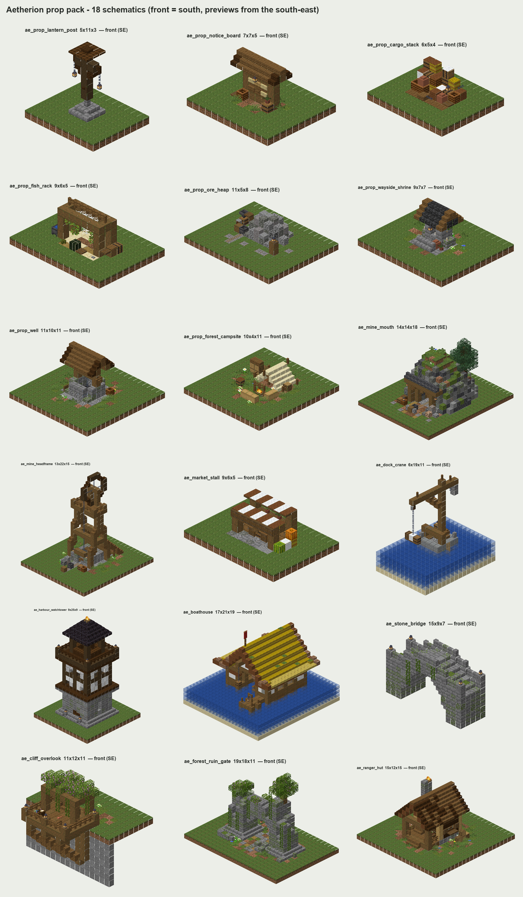

# Aetherion prop pack — 18 placeable schematics

Standalone buildings and props for dropping into gaps on Anker Harbour and the Eldervale pads.
They are vanilla 1.21.1 blocks only: no entities, no command blocks, no resource-pack models.
Each file is a Sponge v3 `.schem` with DataVersion 3955, the same layout FAWE wrote for the Eldervale island files.

Every piece has a preview at `previews/<name>.png`, showing the front (south-east) and the back (north-west).
The green or water plane in a preview is only there for context. It is not in the schematic.

---

## How to paste (FAWE / WorldEdit)

1. Copy `schematics/*.schem` into `plugins/FastAsyncWorldEdit/schematics/` (or `plugins/WorldEdit/schematics/`).
2. `//schem load ae_boathouse`
3. Optional: `//rotate 180` turns the front to face north, and `//rotate 90` or `//rotate 270` turn it east or west. Every piece is authored with its **front facing south**.
4. Stand on the spot described in the table below and run **`//paste -a`**.
   * `-a` skips air, so the terrain and trees inside the bounding box survive. **Don't paste without `-a`**, or you'll carve a box out of the island.
   * `-s` also selects the pasted region, which is handy for a quick look or `//undo`.

**Paste point rule.** The block your feet are in is the anchor. The piece's ground layer replaces the block you're standing on, so floors, plinths and paving sit flush with the terrain. Some pieces carry a footing below the ground layer (the "below" column) so they grip uneven or floating edges.

Things to know:
* Leaves are all `persistent=true`, so nothing decays.
* Block entities are included with empty inventories: barrels, decorated pots, signs, bells, beds, banners and campfires. Signs are waxed.
* Lit campfires make smoke on purpose: the campsite, the ranger hut chimney, and the watchtower signal fire. The shrine candles are lit.
* Cobwebs are used as fishing nets (fish rack, boathouse) and as a web in the mine shaft.
* The only water in any file is inside the well ring. Water pieces rely on the sea already being there.
* Rails are real rails (ore heap, mine mouth, headframe). No minecarts are included.

---

## Accents (drop into 3×3 … 11×11 gaps)

| File | Size W×H×L | Below | Zone | What it is | Paste tip |
|---|---|---|---|---|---|
| `ae_prop_lantern_post` | 5×11×3 | 1 | harbour / anywhere | Dark-oak harbour lamp: stepped stone plinth, twin bracket arms, lanterns on chains, thin trapdoor hat. | Stand where the post goes. The arms run east–west; `//rotate 90` makes them run along a north–south path. |
| `ae_prop_notice_board` | 7×7×5 | 0 | anywhere (paths, harbour, pad landings) | Shingle-roofed board with birch/oak sign "papers" (notices, a lost cat, ore wanted), eave lantern, barrel and crate. | Centre of the board; it reads from the south. Sign text is waxed, so edit it in the schem or re-place the signs for quest text. |
| `ae_prop_cargo_stack` | 6×5×4 | 0 | harbour (quays, dock ends, warehouse doors) | Stepped cargo pile: slatted crates, barrels on their sides, wool sacks, hay, tarp, amphorae, a lantern. | Put the tall (north) side against a wall or the water. |
| `ae_prop_fish_rack` | 9×6×5 | 0 | fishing / beach | Timber drying rack hung with seaweed strands and nets, salt barrel, water trough, gutting bench, sand skirt. | Centre. Its sand/coarse-dirt skirt blends into beaches. |
| `ae_prop_ore_heap` | 11×5×8 | 0 | mining (yards, cart tracks) | Tuff/cobble/gravel spoil heap with ore faces and raw-ore lumps, rail spur ending in a tub, sieve bench (hopper over barrel), grindstone, lamp stake. | Centre of the heap. Rotate so the rail spur points at your track or mine mouth. |
| `ae_prop_wayside_shrine` | 9×7×7 | 1 | foraging / anywhere | Mossy roadside shrine: arched candle niche, dark tile roof, hanging lantern, flower pots, decorated pot, vines. | Face it toward the path. Candles are lit. |
| `ae_prop_well` | 11×10×11 | 1 | anywhere / farming (squares, pad plazas) | Round cobble well with water, windlass drum and crank, bucket on a chain, spruce gable roof, lantern. | Stand in the centre of the well. Water sits flush with the ground inside the ring over its own stone floor. |
| `ae_prop_forest_campsite` | 10×4×11 | 0 | foraging / anywhere | Ranger camp: canvas A-tent with bedroll and lantern, fire with a spit, log benches, covered firewood, stump, pack. | Centre. The tent opens south toward the fire. |

## Mid-size buildings

| File | Size W×H×L | Below | Zone | What it is | Paste tip |
|---|---|---|---|---|---|
| `ae_mine_mouth` | 14×14×18 | 0 | mining (island edges, beside ore pads) | Timbered adit in a mossy tuff/deepslate outcrop: portal with header beam, corbels and a "SHAFT III" hanging sign, lagged tunnel that bends west with lanterns, rails out to a buffer and ore tub, crates, ore pile, spruce on top. | Free-standing outcrop: paste on flat-ish ground and nothing needs carving. Stand on the tunnel line in the middle of the outcrop; the portal ends up 6 blocks south of you. |
| `ae_market_stall` | 9×6×5 | 0 | harbour / anywhere (plazas, quays) | Striped brown/white canvas stall: stepped carpet canopy with fascia, barrel counter with wares, back rack, "~ Wares ~" hanging sign, produce and sacks. | Centre. The counter faces south. Looks good in a row of 2–3 with some turned 180°. |
| `ae_dock_crane` | 6×19×11 | 6 | harbour / fishing docks | Stone pier head with a spruce jib crane: braced mast, counterweight, grindstone pulley, hoisted cargo pallet on a chain, winch drum, bollards, sea ladder. | y=0 is quay-deck level. Stand where the pier head goes at quay height, on a temp block in the water if needed. The pier runs 6 down; the jib reaches 7 south over the water. |
| `ae_stone_bridge` | 15×9×7 | 4 | anywhere (streams, gullies, gaps between lobes) | Hump-backed mossy stone footbridge: stair-rounded arch with a keystone lantern, slab ramps you can walk without jumping, wall parapets, lantern pillars at each end, vines over the arch. | Centre of the span; y=0 = bank level at both ends. It spans east–west. Best over a 5–7 wide dip, and it still works as a hump bridge on flat ground. |
| `ae_cliff_overlook` | 11×12×11 | 5 | anywhere on an island edge | Cantilevered spruce viewing deck: posts and struts down the cliff face, railing with lantern posts, azalea-draped pergola over a bench, copper spyglass on a tripod, cartography table. | Stand on the **last land block before the drop**, facing south over the edge. The back rows sit on land and the front hangs over the void. |
| `ae_ranger_hut` | 15×12×15 | 1 | foraging (clearings, beside tree pads) | Log cabin of horizontal spruce logs on a stone plinth, with a mixed-shingle gable (brown wool underlay) running out over a railed porch. It has a stone chimney with a smoking fire, shuttered windows with flower sills, and firewood under the back eave. The inside is furnished. | Centre of the cabin. The door faces south. |

## Landmarks

| File | Size W×H×L | Below | Zone | What it is | Paste tip |
|---|---|---|---|---|---|
| `ae_harbour_watchtower` | 9×25×9 | 2 | harbour (quay corners, headlands, breakwater ends) | Battered stone base with a door, iron slits and "HARBOUR WATCH" sign. Above it: a dark-oak timber stage with plaster panels, a corbelled lookout gallery with lantern posts, and an open cabin with a tide bell. On top: a blackstone hip roof crowned by a signal fire. A ladder runs all the way up. | Centre. The signal fire (lit campfire) can be seen across the harbour. |
| `ae_boathouse` | 17×21×19 | 5 | fishing / harbour shoreline | Blocky-Verse-style boathouse on stilts. It has a stepped hay thatch with brown-wool/mud-brick verges and moss, a timber frame with plaster and wool bands, and an open boat bay with a moored plank rowboat. There's a hoist beam with a barrel in the gable, a red ridge pennant, and a side jetty with a lamp. | **y=0 = water surface.** Stand with your feet one block above the water, in the middle of where the bay should be, with the back door (north) toward the shore. Stilts go 5 below the waterline. |
| `ae_forest_ruin_gate` | 19×18×11 | 1 | foraging (forest paths, grove edges) | Two crumbling mossy towers and a half-collapsed arch over a broken paved path. There's rubble, a fallen pillar, a lantern still hanging from the keystone, hanging roots and vines, and a young oak growing out of the east tower. | Centre of the arch. The path runs north–south through it, with 5 blocks of walk-through clearance. |
| `ae_mine_headframe` | 13×22×15 | 1 | mining (quarry floors, beside a pad) | Tapered timber A-frame headframe with backstays over a raised shaft collar. It has a dark-oak sheave wheel with chain spokes, a hoist chain down to a kibble, a half-hatched opening, a railed top platform, lanterns, a "SHAFT II" sign, a winch drum, and a rail spur with a tub. | Centre of the collar. The shaft floor is a dark block at ground level, so it reads as a drop. For a real shaft, dig a 3×3 hole under the collar before pasting. |

---

## Style notes: what was matched

I didn't eyeball the references. I parsed the actual Eldervale schematics (Farming, Fishing, Foraging, Mining by Blocky Verse) and the OriginBuilds Skyblock RPG Spawn world, counted their blocks and rendered close-ups of their buildings:

* **Timber:** stripped spruce logs as posts, stripped spruce wood (bark all round) as beams, spruce stairs, slabs and trapdoors for trim. Dark oak for harbour pieces, matching the spawn harbour.
* **Walls:** plaster infill of white concrete powder, white wool, light-gray wool and white concrete, with brown wool bands (fishing). Horizontal logs for the forest cabin.
* **Roofs:** stepped hay thatch with brown-wool/mud-brick rims (fishing), mixed spruce stairs over brown wool (foraging), cracked deepslate tiles (mining), blackstone stairs (spawn harbour).
* **Stone:** stone bricks mixed with mossy and cracked bricks and andesite. Tuff, cobble and deepslate for outcrops. Polished andesite quoins and curbs.
* **Ground:** moss block, grass, rooted and coarse dirt with ferns, short grass and small flowers. Dirt path, packed mud and pavers for paths.
* **Micro-detail:** lanterns on chains, upside-down-stair corbels and struts, trapdoor shutters and sills, buttons as pebbles and nails, wall signs as plaques, decorated pots.

Everything is baked the way the game would place it: fence, wall and pane connections, stair corners, persistent leaves, and doors, beds and tall plants with both halves. FAWE pastes states as-is without neighbour updates, so this matters. Every plant sits on real soil and every lantern, candle, ladder and sign has vanilla-valid support, so nothing pops off when a neighbour block updates later.

## Regenerating or tweaking

The pieces are generated by the small Python toolkit in `tools/` (see `tools/README.md`). Edit a builder in `tools/pieces/*.py`, run `python build_all.py <name>`, and you get the `.schem` and preview back. `python validate.py` re-checks every file against the 1.21.1 block registry.
