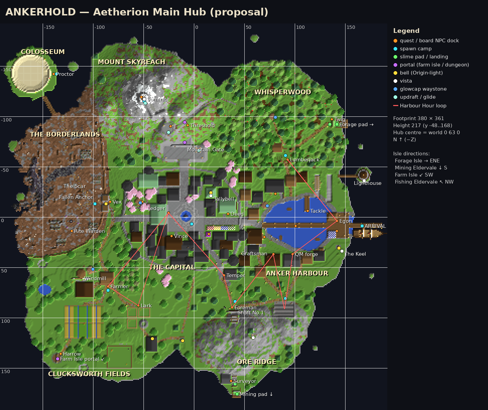
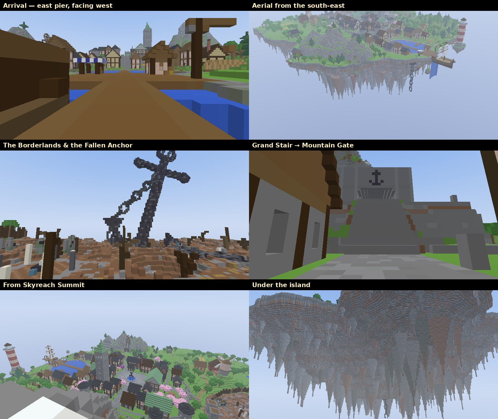

# Ankerhold — the new Main Hub

**Status:** proposal build. It is walkable and the terrain is finished. The buildings are styled shells: walls, roofs and windows are done, the interiors are sparse. Nothing is deployed and no plugin code was touched.
**Files:** `_hub_ankerhold_build/ankerhold_hub.schem` (Sponge v3, DataVersion 3955 / 1.21.1), `_hub_ankerhold_build/ankerhold_anchors.yml` (every coordinate below, machine-readable), `_hub_ankerhold_build/gen/` (the generator, so the build can be regenerated).
**Size:** 380 × 361 blocks (x −188..191, z −181..179), y −48..168, about 4.8 M blocks, 196 block entities.

---

## 1. The idea

Ankerhold was once moored to the world below by three colossal chains. Two still hang under the island: one under the harbour lip and one under the Capital's keel. The third snapped. Its anchor tore up out of the deep and slammed into the west rim. Nothing has grown there since. **That impact zone is the Borderlands.** The anchor still stands in it, 70 blocks tall and tilted, with its broken chain trailing over the edge into the void. Vex holds the line at the palisade.

The name, the danger edge and the hub's main landmark all come from that one fact. Nobody explains it: players see the chains from the pier and the anchor from the Capital, and they work it out themselves.

**Function is preserved, form is new.** Every spawn id, quest NPC id, pad id and the Harbour Hour spine survive. The map, its districts, its silhouette and its scale are all new.

## 2. Layout

There are three height bands: the harbour at y 64–70, the Capital terrace at y 78, and the mountain at y 125–159. The districts sit around the Capital, and each one faces the skill isle it serves.

| District | Ground y | What it is for | Signature | Quest cast |
|---|---|---|---|---|
| **Anker Harbour** (east) | 64–70 | Arrival, first hour, fishing | A 110-block pier over the lagoon. The pier head sits over **the Spill**, where the lagoon pours off the edge. A moored sky-sloop. Seawatch Light on its own rock. The Guild Slips. | Egon, Fishmonger, Tackle, Quartermaster, Craftsman, Bar Whisper, Merchant |
| **The Capital** (centre) | 78 | Rules, skills, social | A walled terrace with six bastions. Ledger's Court with the wishing fountain (an anchor statue on top). The **Tallybell** with its copper spire, which you can climb. Registry, Lucky Knot, Archive, Cherry Garden. | Ledger, Deed, Vince, Liquidator, Orla (board) |
| **Whisperwood** (north-east) | 72–86 | Wood loop and the Forage departure | Lumber camp and chop grove. Twig's deck juts out over the eastern cliff. | Lumberjack, Twig |
| **Ore Ridge** (south) | 70–111 | Coal, mining, the Mining departure | The coal cut. **Shaft No. 1** runs right through the ridge and comes out on the Surveyor's Ledge and the Mining pad. Headframe. Ridge Lookout. | Foreman, Surveyor, Temper (at the South Gate) |
| **Clucksworth Fields** (south-west) | 74–80 | Farming, pets, Farm Isle | Windmill hill, red barn, crop strips, orchard, pond, Lark's Menagerie, Field Chapel. **Harrow's Gate**, the Farm Isle portal, sits on the south-west headland. | Farmer, Lark, Harrow |
| **Mount Skyreach** (north) | 88–159 | Aspiration, the dungeon | The Grand Stair leads to the **Mountain Gate**. Inside is the Threshold hall with the dungeon frame. The updraft vent lifts you to Skyreach Terrace, and a switchback path climbs to the summit. | Threshold, Cobb + Stellan (boards) |
| **The Borderlands** (west) | 66–74 | The danger edge, rites, the arena | Vex's palisade and gatehouse. **The Fallen Anchor**. **The Scar**, a crack straight through the island. The burnt quarter. The Rite Circle. A rope bridge leads to the **Colosseum** on its own floating fragment. | Vex, Rite Warden, Proctor |

**Each departure points at its real isle in `world`.** The Forage pad faces east-north-east, toward Forage Isle. The Mining pad faces due south, toward Mining Eldervale. The Farm portal faces south-west. Fishing Eldervale lies north-west, and you can see that direction from the summit. Leaving the hub feels like flying to a place you can actually locate.

## 3. Player flow

| Window | What happens |
|---|---|
| **30 s** | You spawn on the pier next to the sky-sloop's gangway. Ahead and down is the lagoon, the town, the Capital wall and the Tallybell. **Egon is 25 blocks ahead** at the pier head, with the starter hint ("green glow on the pier"). |
| **2 min** | You talk to Egon, with the Fishmonger bickering beside him. The waterfall runs under the deck. The lighthouse, the ridge headframe and the mountain are all in view. |
| **5 min** | The first walk: along the north quay and up the dirt road into Whisperwood to the Lumberjack. |
| **15 min** | The loop opens up: Quartermaster's forge → coal cut → Craftsman → Shaft No. 1 → Temper at the South Gate. Coming up the South Gate stair onto the Capital terrace is the "this is a city" moment. Ledger is on her porch on the far side of Ledger's Court. |

**The Harbour Hour loop is about 730 blocks straight-line, down from about 1,870 on the old map.** The route is Egon → Lumberjack → Egon → QM → coal → Craftsman → Foreman → Temper → Ledger → Farmer + Lark → Ledger (the red line on the map). It's 2.5× shorter, and every leg passes something new.

**Returning players:** `/spawn` goes to the camp they chose. All the camps sit on their district's main road. From the Capital camp, the Harbour Steps, the South Gate, the West Gate and the Grand Stair are each within about 65 blocks. The pads have light columns (Origin pad flair), so you can see them from a distance.

## 4. Discovery layer (Origin, slimmed down)

The mechanics are the same as Origin's, but there's less of everything, and every item has a reason to be where it is.

- **Bells (5):** Harbour Bell (south horn), the **Tallybell** (climb it or hit it with an arrow), Vex's warning bell, Field Chapel, Wayside Shrine (over the south bay).
- **Vistas (5):** Skyreach Summit, Tallybell belfry, Ridge Lookout, Seawatch Light gallery (by ladder), **The Keel** (secret).
- **Glowcap waystones (4):** Harbour, Capital (in the Cherry Garden), Whisperwood knoll, Fields (by the windmill).
- **Vertical travel:** Skyreach Updraft (copper-grate vent on the gate platform → terrace) and the Summit Glide (summit ring → Ledger's Court). Both corridors were checked against the terrain with 0 collisions.
- **Boards (3):** Orla (journal, tour, bells, glowcaps), Cobb (skyways, on the terrace), Stellan (summit). Aurel and Fen are folded into Orla.
- **Secrets:** The Keel is a hatch on the south quay. A stair leads through the rock to a balcony under the harbour lip, next to the hanging Harbour Chain. There's a goat path from Whisperwood up to Skyreach Terrace, so explorers can skip the updraft. You can climb the Tallybell's spiral stair. Rock bridges cross the Scar.
- **Future hooks (empty on purpose):** the Guild Slips (an unfinished hull on a slip marked "reserved for the first guild to sail"), the Archive (codex/collections), the Threshold frame, and the burnt quarter.

## 5. Pasting it

- **Test world first:** a void world (Multiverse + VoidGenerator), with plains biome so the grass tint looks right.
  1. Stand anywhere and run `//schem load ankerhold_hub`.
  2. Run `//paste -o -a`. The `-o` flag restores the design coordinates (the hub centre lands at 0 63 0); `-a` skips air.
  3. Run `/setworldspawn 166 65 8`.
- **Live `world`:** the old 1000×1000 map has to go first. Its Origin footprint is x −540..470 and z −630..380. Leave the isle volumes alone: the Mining Eldervale paste, the Forage Isle, and the `aether-paste` `last:` AABBs for Farming/Fishing. Make a backup first. Then paste with `-o`.
- **Physics:** nothing updates on paste. The Spill's falling water is pre-placed down to y 28 and will extend toward the void on its first update, which is harmless. Leaves are persistent. Fences, walls and panes are pre-connected.
- **Lighting:** there are lanterns on the quays, roads, streets and gates. Run Origin softlight for the rest, but update `softlight.exclude` first so the Borderlands stay dark.

## 6. Integration seams (mechanical re-pointing)

All coordinates are **feet positions in design coordinates**, i.e. after `//paste -o`. If you paste somewhere else, add the offset of your paste origin from 0 63 0. Wire them in this order: Hub `config.yml` (spawns, pads) → Quests `npcs.yml` → Farming portal + Dungeons `hub-portal` → `origin.yml` (rewrite, see below).

### Spawn camps (`spawns.*` in Hub `config.yml`)

| id | feet x y z | yaw | discover radius | spot |
|---|---|---|---|---|
| `harbour` | `166.5 65 8.5` | 90 |  | Arrival: east pier beside the sky-sloop's gangway; also world spawn |
| `capital` | `-2.5 79 6.5` | 90 | 36 | Capital camp: Ledger's Court south side |
| `mines` | `40.5 73 83.5` | 0 |  | Mines camp (mine apron) |
| `ore_ridge` | `90.5 72 80.5` | 0 | 30 | Ore Ridge camp (coal cut) |
| `whisperwood` | `90.5 74 -61.5` | 0 | 30 | Whisperwood camp (keeps the old id) |
| `farm` | `-85.5 75 72.5` | 0 | 28 | Farm camp (farmhouse yard) |
| `borderlands` | `-98.5 72 -13.5` | 90 | 30 | Borderlands camp (just inside Vex's gate) |
| `colosseum` | `-136.5 74 -142.5` | 90 |  | Colosseum camp |
| `summit` | `-49.5 159 -115.5` | 0 | 18 | Summit camp (Origin) |

World spawn (`/setworldspawn`, first join): `166.5 65 8.5`, yaw 90 — the arrival pier. Off-hub camps (`forage_isle`, `farm_isle`, `eldervale`, `fishing_eldervale`) don't change.

### Island pads (`island-pads.pads.*`)

| pad | slime volume (min → max) | lands at | note |
|---|---|---|---|
| `origin_to_mining` | `40 72 174` → `44 72 176` | `53.5 91 482.5` (as before) | 307.2 blocks due south: raise `boost-ticks` |
| `mining_to_origin` | as before (on the isle) | `40.5 73 165.5` | new `target`: the Surveyor's Ledge |
| `origin_to_forage` | `139 73 -95` → `143 73 -91` | `479.5 74 -240.5` (as before) | 369 blocks ENE: raise `boost-ticks` |
| `forage_to_origin` | as before (on the isle) | `134.5 74 -92.5` | new `target`: Twig's deck |

The arcs were checked against the build; nothing on the island is in the way. As a rule of thumb, `boost-ticks ≈ distance ÷ horiz-speed`: about 100 for Mining and about 125 for Forage.

### Portals

| portal | at | note |
|---|---|---|
| `farm_isle` | `-135.5 75 140.5`, frame `-136 75 138` → `-136 79 142` | Farm Isle portal frame (re-point FarmPortal* region here; Farming 10 gate stays in Farming) |
| `dungeon_hub` | `-9.5 89 -94.5`, r = 3.5 | Dungeon departure (AetherionDungeons hub-portal centre, r≈3.5) -> mmo-d |
| `dungeon_return` | `-9.5 89 -74.5` | return landing in the hall |

### Quest NPC docks (AetherionQuests `npcs.yml`)

The ids, quests and TalkUx all stay as they are. Only the position and yaw change.

| npc id | feet x y z | yaw | spot |
|---|---|---|---|
| `arena_proctor` | `-139.5 74 -142.5` | -90 | Proctor at the Colosseum gate |
| `bar_whisper` | `69.5 66 19.5` | -90 | Bar Whisper at the Salt Barrel's quay counter |
| `booster_tutor` | `29.5 72 57.5` | 90 | Temper's smithy at the South Gate stair foot ('on the road to Capital') |
| `craftsman` | `78.5 68 36.5` | 180 | Craftsman at the workshop door |
| `dockhand` | `100.5 65 8.5` | 90 | flavour: dockhand on the long pier |
| `dungeon_gate` | `-6.5 89 -91.5` | 0 | Threshold, keeper of the dungeon frame |
| `egon` | `141.5 65 3.5` | -90 | Egon greets arrivals at the pier head (green glow) |
| `farm_isle_guide` | `-132.5 75 135.5` | 90 | Harrow beside the Farm Isle portal |
| `farmer` | `-85.5 75 68.5` | 0 | Farmer on the farmhouse porch |
| `fisher` | `112.5 65 -6.5` | 0 | Tackle — fishes off the end of the north pier |
| `fishmonger` | `141.5 65 13.5` | -90 | Fishmonger's stall beside Egon (they bicker) |
| `forage_pad_guide` | `136.5 74 -97.5` | -90 | Twig beside the Forage pad |
| `foreman` | `37.5 73 89.5` | 180 | Shaft Foreman at the mine mouth |
| `isle_clerk` | `33.5 79 -3.5` | 0 | Deed at the Harbour Registry (personal island deeds, guild charter) |
| `lark` | `-55.5 75 87.5` | 180 | Lark at her menagerie gate (pocket_zoo) |
| `ledger` | `-25.5 79 -4.5` | -90 | Miss Ledger at her porch desk, facing Ledger's Court |
| `liquidator` | `14.5 79 16.5` | 180 | Crystal Liquidator's kiosk by the plaza |
| `lumberjack` | `92.5 74 -57.5` | 0 | Lumberjack/Forager at the camp (chop demo) |
| `merchant` | `80.5 67 -23.5` | 0 | Merchant at the warehouse |
| `quartermaster` | `97.5 66 36.5` | 180 | Quartermaster at the forge front |
| `rite_keeper` | `-121.5 70 13.5` | 180 | Rite Warden at the Rite Circle |
| `surveyor` | `36.5 73 162.5` | -90 | Surveyor — stamps the blueprint that unseals the Mining pad |
| `vex` | `-83.5 72 -15.5` | -90 | Sergeant Vex outside his gate (danger edge) |
| `vince` | `-22.5 79 18.5` | 180 | Lucky Vince outside the Lucky Knot |

These stay off the hub, where they are now: `eldervale_welcome`, `eldervale_upgrade`, `canopy_clerk`, `amethyst_mines_guide`, `root_cellar`.

### Origin townsfolk (Hub boards, `origin-cast.yml`)

| who | feet x y z | yaw | note |
|---|---|---|---|
| Cobb Kettleby | `-23.5 125 -90.5` | 0 | Origin skyway board (or move to the gate platform) |
| Orla Vane | `-51.5 79 -15.5` | -90 | Origin board (journal / tour / bells / glowcaps folded in) |
| Stellan Voss | `-52.5 159 -119.5` | 0 | Origin summit stargazer (vistas, wishes) |

Sister Aurel (bells) and Fen Glowmoor (glowcaps) are folded into Orla's board.

### Origin-light anchors (`origin.yml`)

| kind | id | at | note |
|---|---|---|---|
| bell | `harbour` | `143.5 68 30.5` | Harbour Bell on the south horn |
| bell | `tallybell` | `16.5 118 -24.5` | Tallybell — ring it with an arrow, or climb up |
| bell | `wayside` | `-11.5 75 122.5` | Wayside Bell (south bay shrine) |
| bell | `field_chapel` | `-41.5 85 120.5` | Field Chapel bell (over the south bay) |
| bell | `vex_gate` | `-87.5 79 -13.5` | Vex's warning bell over the gate |
| vista | `lighthouse` | `168.5 106 -36.5` | Lighthouse gallery (vista) |
| vista | `tallybell` | `16.5 113 -21.5` | Belfry gallery (vista) |
| vista | `ridge_lookout` | `58.5 107 119.5` | Ridge Lookout (vista): harbour, capital, Mining Eldervale |
| vista | `skyreach_summit` | `-49.5 159 -117.5` | Skyreach Summit (vista) |
| vista | `the_keel` | `146.5 51 33.5` | The Keel — balcony under the harbour lip; the Harbour Chain hangs beside it (secret vista) |
| waystone | `harbour` | `72.5 65 -11.5` | Harbour glowcap sprout (Origin-light) |
| waystone | `capital` | `-53.5 79 -14.5` | Capital glowcap (Origin-light waystone) |
| waystone | `whisperwood` | `80.5 83 -99.5` | Whisperwood glowcap |
| waystone | `fields` | `-100.5 77 51.5` | Fields glowcap |
| updraft | `skyreach.floor` | `4.5 89 -66.5` | Skyreach Updraft floor (copper grate vent) |
| updraft | `skyreach.top` | `-25.5 125 -84.5` | Skyreach Updraft top (terrace); glide corridor NW from (4.5, 132, -66.5) |
| glide | `summit.ring` | `-48.5 159 -113.5` | Summit Glide rift -> Ledger's Court; path over the Grand Stair |
| fountain | `ledgers_court` | `-7.5 79 -0.5` | Wishing fountain (sneak+right-click water). Anchor statue on top. |
| emitter | `qm_forge` | `96.5 67 47.5` | forge smoke/clank emitter |
| emitter | `lighthouse` | `168.5 108 -41.5` | rotating beam emitter |
| emitter | `coins` | `-19.5 79 22.5` | coins emitter (Vince's tables) |
| emitter | `temper_forge` | `40.5 73 56.5` | forge emitter |
| emitter | `colosseum` | `-161.5 77 -142.5` | arena crowd emitter |
| secret | `keel_hatch` | `126.5 65 33.5` | Keel hatch on the south quay |
| hook | `guild_slips` | `128.5 65 -30.5` | Unfinished guild slips (future guild harbour hook) |

Summit Glide waypoints (checked against the terrain, 0 hits): `-48.5 159.3 -113.5  /  -48.5 161 -109.5  /  -30 165 -96  /  -12 157 -64  /  -6 104 -30  /  -3 86 -2  /  -2.5 79 6.5`

Skyreach Updraft: the column runs `4.5 89 -66.5` → `4.5 133 -66.5`, then glides `4.5 133 -66.5  /  -19.5 130 -78.5  /  -25.5 125.2 -84.5` (0 hits).

### Break / regen regions (protection seams)

| region | min → max | what |
|---|---|---|
| `mine_first_shift` | `37 73 95` → `43 76 118` | Shaft No. 1 ore walls (Foreman's first shift) — break/regen region |
| `ore_ridge_coal` | `80 70 84` → `99 95 99` | Coal cut (Quartermaster's forge_coal errand) — break/regen region |
| `chop_grove` | `67 69 -85` → `113 89 -39` | Chop grove: 18 plain oaks for the lumberjack demo — break/regen region |
| `farm_fields` | `-128 74 88` → `-90 75 120` | Crop strips (Farmer's farm_hand) — harvest/regen region |

Origin `footprint` / rescue box: x/z `-196..196`. `rescue.floor-y` stays at −60. Everything else should default to deny-break (via WorldGuard or a Hub guard).

### Landmarks (district / landmark discovery)

| id | at | note |
|---|---|---|
| `the_spill` | `150.5 65 8.5` | Pier head over the Spill (lagoon waterfall) |
| `lighthouse` | `168.5 73 -41.5` | Seawatch Light (rope bridge from the north horn) |
| `tallybell` | `17 79 -18.5` | The Tallybell (capital landmark) |
| `ledgers_court` | `-23.5 79 -2.5` | Ledger's Court (capital plaza) |
| `registry` | `33.5 79 -2.5` | Harbour Registry — deeds & guild charters |
| `archive` | `-44 79 -29.5` | The Archive (codex/collections vibe; future hook) |
| `shaft_no1` | `40.5 73 94.5` | Shaft No. 1 — runs right through the ridge |
| `surveyors_ledge` | `42.5 73 164.5` | Surveyor's Ledge — Mining Eldervale on the southern horizon |
| `forage_skyway` | `141.5 74 -98.5` | The Forage Skyway (pad deck) |
| `wayside_shrine` | `-11.5 73 116.5` | Wayside Shrine over the south bay |
| `orchard` | `-63 76 59` | Orchard (blossoming azalea + oak) |
| `red_barn` | `-98.5 76 72.5` | Clucksworth red barn |
| `windmill` | `-111.5 81 62.5` | Clucksworth windmill (hill landmark) |
| `menagerie` | `-55.5 75 100.5` | Lark's Menagerie (pets hint) |
| `farm_isle_gate` | `-135.5 75 140.5` | Harrow's Gate — Farm Isle to the south-west |
| `vexs_gate` | `-84.5 72 -13.5` | Vex's Gate |
| `the_scar` | `-131.5 69 -26.5` | The Scar — a crack straight through the island |
| `fallen_anchor` | `-136 70 -24` | The Fallen Anchor — Ankerhold's torn third mooring (ring top ~y 133) |
| `burnt_quarter` | `-110.5 71 -40.5` | The burnt west quarter (houses that stood where the anchor came down) |
| `rite_circle` | `-121.5 70 9.5` | The Rite Circle |
| `colosseum` | `-161.5 74 -142.5` | The Colosseum (floating fragment) |
| `colosseum_bridge` | `-144 74 -111.5` | Rope bridge from the Borderlands to the Colosseum fragment |
| `mountain_gate` | `-9.5 89 -67.5` | The Mountain Gate (Grand Stair top) |
| `skyreach_terrace` | `-25.5 125 -87.5` | Skyreach Terrace (updraft landing) |
| `harbour_chain` | `142.5 57 43.5` | Mooring chain hanging from the underside |
| `capital_chain` | `-5.5 -23 6.5` | Mooring chain hanging from the underside |

### `origin.yml` — rewrite, don't port

- **`districts`:** replace the 13 old districts with these 7: harbour, capital, whisperwood, ore_ridge, fields, skyreach, borderlands, plus the Colosseum as a small extra circle. The table in §2 gives each district's area and soundscape.
- **`landmarks`, `bells`, `vistas`, `waystones`, `updrafts`, `flights`, `cast.presets`:** use the tables above.
- **`emitters`:** keep to about 12. The anchors list the lighthouse, both forges, Temper, Vince's coins and the Colosseum crowd. Add the harbour gulls/surf and Borderlands bones/wind with care.
- **`footprint`:** use ±196.
- **Old camps:** `whisperwood` keeps its id (it's now the Lumber Camp), and so does `summit`. Coordinates from the old map are no longer valid anywhere.

## 7. Verified offline

- **Block states:** all 365 states validate against the Minecraft 1.21.1 block definitions (0 invalid). The schematic reads back byte-identical to the build.
- **Standability:** all 56 docks, camps, landings and vistas have solid ground underfoot and air at feet and head, with no plants on the dock cells.
- **Reachability:** an on-foot check from the arrival spawn (step up ≤ 1, drop ≤ 3) reaches **every** NPC dock, camp, pad, landing, waystone, vista and portal. The one exception is the Seawatch Light gallery, which you reach by ladder, as intended.
- **Flight paths:** the Summit Glide, the Skyreach Updraft, and both pad arcs inside the hub box have 0 terrain collisions.
- **Old map vs new:** the Harbour Hour loop goes from about 1,870 to about 730 blocks straight-line. The footprint shrinks from 985 × 981 to 380 × 361.

## 8. Not done yet / next pass

- **Interiors:** shells only. Key NPCs stand outside on purpose (TalkUx bubbles need space). Shops, the Counting House, the Registry and the tavern want a dressing pass with the prop wand.
- **Pads:** need a `boost-ticks` retune for the longer flights (see the pad table). The stamped-blueprint gate is unchanged.
- **Farm Isle portal:** the frame is built; the portal blocks and region stay Farming's job (Farming 10 gate).
- **Protection:** the regions are listed, but the rules (WorldGuard or a Hub guard) still need to be written before public play.
- **The Scar:** it really is a hole through the island. Edge rescue catches anyone who falls. If it's too mean, fill its rock bridges wider in `gen/d_border.py`.
- **Tweaking:** the generator is deterministic. Run `python make.py` in `gen/` to rebuild the schematic and the anchors (you need numpy, scipy, nbtlib, pyyaml and Pillow). The district modules are `d_harbour.py`, `d_capital.py`, `d_ridge.py`, `d_whisper.py`, `d_fields.py`, `d_border.py`, `d_mountain.py` and `d_sky.py`.
