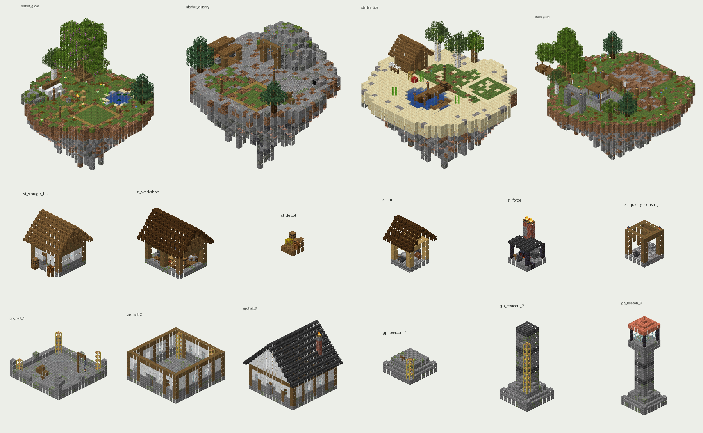

# Island · Quarry · Guild highlight ship (AetherionGuilds)

Personal islands, guild islands and quarries, evolved into one highlight system: an unlock beat, three authored
starter isles, SkyBlock-style land buying, placeable structures, physical quarries on real belts
(quarry → mill → forge → Storage Hut), and guild projects that rise in stages.

**AetherionGuilds only.** No Items, Core, Hub, Quests, TalkUx, rank, weapon, booster/anvil or shutdown file is touched.
**Not compiled here** (no Maven access in my sandbox; you compile). **Nothing deployed.** No checkout was modified;
everything sits in this folder until you run the apply script.



## What's in the folder

| Path | What |
|---|---|
| `apply-island-highlight.ps1` | Guarded apply: `-DryRun`, `-AlsoMainCheckout`, `-Worktree <root>`, `-Force`, `-Compile`. Writes only the 63 manifest paths, and only under `AetherionGuilds\src\main\` (+ one doc) |
| `MANIFEST.tsv` | 63 rows: 15 changed files (base SHA-256 raw/CRLF + LF, new SHA-256) and 48 new ones (`NEW` = must not exist yet) |
| `files\` | Full contents, text in CRLF like your checkout |
| `patches\island-quarry-highlight.diff` | The same change as one unified diff vs `main` (LF, text files), for review or `git apply` |
| `previews\` | Renders of every template (+ `_overview.png`) |
| `generator\` | The template toolkit: `aeg\starters.py`, `aeg\structures.py`, `build_aeg.py`, `verify_pads.py` (+ the `aeprops` core from the props ship) |
| `TEST_SHEET.md` | In-game checks, in order |

Design doc (also written into the repo by the apply): `files\docs\ISLAND_QUARRY_HIGHLIGHT.md`.

## Apply → build → deploy

```powershell
cd C:\Users\Robbi\IdeaProjects\_island_quarry_highlight_ship
powershell -ExecutionPolicy Bypass -File .\apply-island-highlight.ps1 -DryRun     # expect: 63 would be written (15 update, 48 new), 0 conflicts
powershell -ExecutionPolicy Bypass -File .\apply-island-highlight.ps1             # live-lineage worktree
powershell -ExecutionPolicy Bypass -File .\apply-island-highlight.ps1 -AlsoMainCheckout   # also IdeaProjects\AetherionGuilds
```

- **Default target:** `.claude\worktrees\mining-eldervale-progression-65660c` (same as the previous ships). Its
  `AetherionGuilds` is byte-identical to `IdeaProjects\AetherionGuilds` (checked: all 28 sources + pom/yml match), so
  either or both work.
- **Guard:** a changed file is only replaced if it is exactly the version this was built against (raw or CRLF→LF
  SHA-256) and keeps its own line endings; a new file only if nothing is there; all-or-nothing per checkout;
  re-running is safe. `-Force` keeps a `.bak-islandhl` copy.
- **Build:** `mvn -DskipTests -pl AetherionGuilds -am package` (or `-Compile` on the apply). Guilds still depends on
  Core + PlaceholderAPI only; no new dependency.
- **Deploy (MMO-R):** upload `AetherionGuilds-1.0.0.jar`, **restart** (not `/reload`). Keep the old jar for rollback.

## First boot

- `plugins/AetherionGuilds/templates/` gets 18 `.schem` files (never overwritten later). Log:
  `Island highlight: loaded N structures`, `… N belt tiles`, and once `linked N existing quarries as frameless housings`.
- New files appear as they're used: `island_structures.yml`, `island_logistics.yml`, `guild_projects.yml`.
  `personal_islands.yml` / `guilds.yml` gain `starter`, `parcels` (and `unlock.*`). All additive.
- **Existing islands keep their classic pad** (no starter → the old builder paths, nothing re-pasted). They can buy
  land, build structures and lay belts right away; their tier square stays their build zone plus bought parcels.
- **Existing quarries** keep level, mill and storage. They're linked as frameless housings (a belt may start on any
  cell next to them). *Raise Housing* in the quarry menu builds the headframe, only into empty space.
- Everyone at Level 20+ without an island gets the unlock beat once; existing owners are marked silently.

## Player-facing

| Where | What |
|---|---|
| `/island` | Locked: starter preview. Unlocked, no island: **Choose your Starter**. Else the island menu (+ Build 29, Land 31, Production 33; Tier on 24) |
| `/island build` · `land` · `belts` · `tier` · `production` · `done` | Blueprints · land map · Rail Layer · Island Tier · chains in chat · leave build mode |
| `/guild project` · `build` · `land` · `belts` | Guild projects · guild blueprints (Soldier+, guild bank) · guild land (Mayor+) · Rail Layer |
| Guild menu | + Projects 22, Build 23, Land 24 |
| Quarry menu | + slot 23: Raise Housing / where its belt goes |
| Right-click | Hut/Depot barrels & chests → storage · Mill/Forge hopper, grindstone, furnace → machine · Workshop lectern → blueprints · Harbour board lectern → projects · Housing hopper → quarry menu |
| Admin | `/island admin fx [unlock\|foreshadow\|guild\|guildhint]` (preview the beats on yourself) · `rebuild` (re-place this island's rails from YAML) · `reload-templates` · `info` |

Build modes need no tool item: **Blueprint** = particle ghost (green valid, red blocked cells, yellow front arrow,
orange output chute); right-click builds, left-click rotates, sneak+click cancels. **Rail Layer** = right-click start,
right-click end (straight or L), keeps chaining; left-click a belt takes it up (refunded); chutes glow orange,
existing belts show flow arrows.

## Systems in one breath

- **Starters** (`starter_grove`, `starter_quarry`, `starter_tide`, guild `starter_guild`): ~31×31 authored isles with a
  cone underside, a marked Hut Site (path ring) and a Quarry Pad on the Outpost. They paste over a few ticks
  (3,000 blocks/tick default) with block particles and sounds, then you drift down onto yours.
- **Land:** 16×16 parcels on a 9×9 grid round the origin. Buy one touching your land → ground rises there layer by
  layer in the island's look (grass / rock / sand), or toggle *Raise new ground: OFF* for build rights only.
  Build zone = classic tier square ∪ parcels.
- **Structures:** Storage Hut (first free, 5M raw-eq), Workshop (unlocks the rest + belts), Depot (250k), Mill
  (raw→compressed, needs a Quarry Mill item), Forge (compressed→compacted, needs a Quarry Forge item), Quarry Housing
  (automatic). Protection is exact: only blocks that are still the template's block are protected; anything you
  add inside stays yours. Take down from the menu (empty first, half coins + the item back).
- **Belts:** rails, flat, straight or L. A belt into a hut/depot/mill/forge footprint feeds it; belts merge, never
  split. Routes are resolved on change; flow is arithmetic every second for islands someone stands on and every minute
  for the rest (same numbers offline). Full target → stock stays upstream → a quarry stops at its cap like before.
  Cargo you see is capped (36 per island, 240 total), non-persistent, and glides with client-side interpolation.
- **Guild projects:** Guild Hall (Foundations → Walls → Roof & Banners) and Harbour Beacon (Plinth → Tower → Flame).
  Mayor+ starts (on the Harbour's reserved site, or pick a site with the blueprint ghost). Footman+ give from their
  pack, from the guild's Storage Huts/Depots (belt output counts), coins, or the guild bank (Soldier+). Each paid
  stage transitions on site; every online member gets the title.
- **Unlock beats:** gull's note at Lv15 (needs PlaceholderAPI), unlock at Lv20, claim cinematic, guild founding
  ("We have a place.") and each member's first arrival ("Our place.").

## Config (all optional, defaults in code)

`paste-blocks-per-tick`, `land.parcel-base` (2,500), `land.guild-parcel-base` (10,000), `logistics.belt-coins` (5),
`logistics.max-run` (64), `logistics.cargo-per-island` (36), `logistics.cargo-global` (240),
`unlock.island-foreshadow-level` (15), `unlock.guild-foreshadow-level` (65). Island Tier costs are now coins only:
5k / 20k / 60k / 150k. Numbers are placeholders; balancing was out of scope.

## Re-authoring a template

Any template can be replaced in-game: build it, `//copy` with your feet on the **ground-layer centre** (front facing
south), `//schem save <id>`, put the file in `plugins/AetherionGuilds/templates/`, `/island admin reload-templates`.
Or edit `generator\aeg\*.py` and run `python build_aeg.py --render` then `python verify_pads.py` (checks the Hut/Housing
fit every pad in all 4 rotations and each spawn is safe).

## Verification done here

- **Templates:** 18 schematics built with the props toolkit; every block state validated against the 1.21.1 registry;
  0 support warnings (no floating lanterns/plants/signs). `verify_pads.py`: Storage Hut fits every starter's Hut Site
  and the Quarry Housing fits the Quarry Pad in all 4 rotations; all 4 spawns stand on solid ground with headroom.
  The Harbour's project sites only overlap the site markers, which the stage transition clears.
- **Java template reader** (`Template`/`NbtIn`/`StateRotator`) run standalone against all 18 files: sizes, offsets,
  block counts and sign counts match the generator; rotations of stairs, fences, rails and banners are correct.
- **Syntax:** all 57 Guilds sources parse (tree-sitter-java, Java 21 grammar). Every internal import resolves.
- **Apply script:** its guard logic, ported 1:1, on a CRLF copy and an LF copy of `main`: 63 written (15 update,
  48 new) → re-run 63 up to date → locally edited base = CONFLICT, nothing written. The result equals the authored
  tree. (PowerShell itself wasn't available; ASCII-only, 5.1 syntax like the previous ships.)

**Not done:** the real `mvn` compile and an in-game run. First thing to look at if the compile complains: the Paper
calls listed in *Compile watch-list* below.

### Compile watch-list (Paper 1.21.1 API used for the first time in Guilds)

`BlockData#getSoundGroup`, `SignSide#line(int, Component)`, `Sign#setWaxed`, `Display#setTeleportDuration`,
`ItemDisplay#setItemDisplayTransform`, `Player#sendActionBar(Component)`, `Bukkit.getCurrentTick()`,
`org.bukkit.block.data.Rail`, `Transformation` + JOML, `GsonComponentSerializer`, `PlaceholderAPI.setPlaceholders`.

## Rollback

Put the old Guilds jar back and restart. The old jar ignores the new YAML keys/files (`island_structures.yml`,
`island_logistics.yml`, `guild_projects.yml`, `templates/`); pasted blocks and rails simply stay as blocks. Display
entities are non-persistent, nothing to clean up.

## Suggested commit (in the target checkout)

```
Guilds: island highlight: authored starters (Grove Camp, Quarry Outpost, Tide Dock, Guild Harbour), unlock +
claim beats, land parcels (buy + raise ground), placeable structures (Storage Hut, Workshop, Depot, Mill, Forge,
quarry housings) with ghost placement, Rail Layer belts with route/flow sim + capped cargo visuals, guild projects
(Guild Hall, Harbour Beacon) with staged builds. Island Tier costs coins only. Additive YAML.
```
