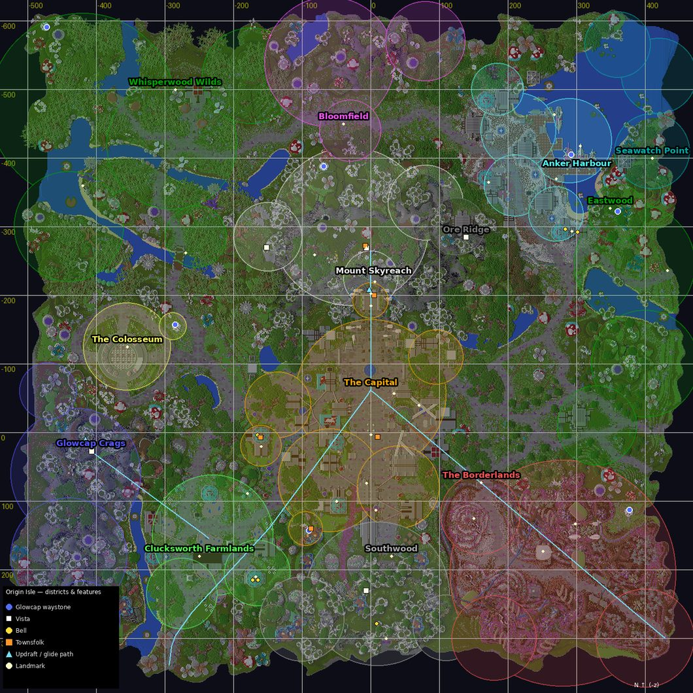

# Origin Isle — main island overhaul (AetherionHub)

The main island (OriginBuilds' "1000×1000 Skyblock RPG Spawn", pasted 1:1 into `world`) gets the same depth as the
Eldervale isles. It has 13 districts, 39 landmarks, 8 glowcap waystones, 5 vistas, the Seven Bells, 2 updrafts,
4 scripted skyways and glides, 40 ambient emitters, 6 island-wide moments, a wishing fountain, 5 townsfolk and a
first-visit tour. All of it is in **AetherionHub** (`de.aetherion.hub.origin`). **AetherionItems** gets one optional
DEV tile in an empty slot. Core, Quests, Mining, Foraging, Farming and Fishing are unchanged.

---

## 0. Ground rules this pass kept

| Rule | How |
|---|---|
| Additive only | Every existing Hub system is untouched in behaviour: spawns/menu, `/spawn` `/hub` `/spawns`, every goto command, `/hubadmin`, `/aetherpaste`, homestead anchors, discover walk-ins, island launch pads, softlight, HubAccess, the prop wand. Origin only listens: 5 one-line hooks, each wrapped so a failure is a no-op. |
| Union of both Hub lineages | The live Hub jar (live lineage: `/mining` `/fishing`, Fishing Eldervale camp) and the main-checkout jar (`/propwand`, 18 prop schems, `wipePlayer`, Bloodstone camp) are merged. Surface diff vs **both**: **MISSING 0**. |
| Quests talk stack locked | No LivingNpc / TalkUx / TalkText / CastBook / skins / DialogManager / `/npc` / dialog fonts. The Quests "Origin cast" (Ledger, Vex, Egon…) is not touched. The 5 Origin townsfolk are Hub-owned villagers with their own PDC tag and their own GUI boards. The nearest one stands 13.9 blocks from any Quests NPC. |
| Other locks | Codex/Skills, Foraging/Mining packages, Anvil sockets, `ranks/player-ranks.yml`, Blossom Blade, Gravwell Cleaver / HorizonFx, ShutdownCountdown, Borderlands vials: not referenced. |
| DevMenu | One tile in the empty WORLDS **slot 39**, beside Mining (37) and Forage (38). Nothing moved. |
| Never breaks the Hub | `OriginIsle.start()` catches everything. A broken `origin.yml` logs one line and the Hub keeps running. The main loop swallows and rate-limits its own errors. |

---

## 1. Gate 0 — the map is the live island

| Check | Result |
|---|---|
| Map file | `Downloads\OriginBuilds - Skyblock RPG Spawn.zip` → nested `1.20+ Version (World File).zip` → level *SilkyParliamentarySeat*, DataVersion 3463 (1.20), flat generator, world spawn `0 57 0`. |
| Footprint | x −526…458, z −616…364. Ground is y 57–64, the peak is y 236 (Skyreach), and the underside is y 13–39 with rock roots to about −50. |
| Paste offset | **None (1:1).** The world spawn is Ledger's plaza (Miss Ledger stands at −1.5 58 −0.5 in live `npcs.yml`). The map's only slime pad (20–24, 54, 304–306; 15 blocks) is exactly the live config pad `origin_to_mining`. **21 of the 21** on-island Quests NPCs in the live snapshot stand on solid ground with air at feet and head. |
| Live additions | `origin_to_forage` (435–441, 54–56, −237…−231) has no slime in the original map, so it was added on live. |
| Unused in the map | Two slime pads under the south arches (SE 428–431/54/299–302, SW −296…−292/54/339–340) are left over from the map. Origin brings them back as scripted skyways. |

Every coordinate in `origin.yml` was measured from the region files: 39 landmarks, 13 district anchors, 8 waystone
stands, 5 vistas, 2 updraft floors and tops, 4 flight landings, 5 cast spots and 2 camps. It was then validated
offline:
- every spot is standable, and the walkable ones are reachable on foot from the plaza;
- every landmark falls inside its own district;
- **BAD 0**.

The updraft tops reach the summit, the Summit Glide ring, the Golden Willows and the Skyreach glowcap on foot. The Crag
top reaches Crag Peak and the Crag Glide ring. The 4 flight paths were validated point-by-point against the height
map, with 0 points under terrain.

### Existing Hub surface (all kept)

| Area | Detail |
|---|---|
| Commands | `/spawn` (`/hub`), `/spawns`. Gotos: `/harbour`, `/oreridge`, `/mines`, `/capital`, `/forage`, `/farm`, `/farmisle`, `/borderlands`, `/colosseum`, `/eldervale`, `/mining`, `/fishing`. Also `/hubadmin`, `/aetherpaste`, `/propwand`. |
| Systems | Spawn menu, HomesteadMarker anchors, first-join hint, SpawnDiscoverListener walk-in unlocks, IslandLaunchPads (stamped-blueprint gate, flight lock, landing grace), SoftLightPass, HubAccessImpl, prop wand + 18 schems, `HubService#wipePlayer` (used by the Items Full Player Wipe through reflection). |

---

## 2. What Origin adds

### Districts & discovery (`OriginCompass`)

13 districts, drawn as y-aware circles (Skyreach sits above the Capital from y 92):

| District | Soundscape |
|---|---|
| Mount Skyreach | mountain |
| Ore Ridge | ridge |
| Anker Harbour | harbour |
| Seawatch Point | harbour |
| The Capital | capital |
| Whisperwood Wilds | wilds |
| Bloomfield | meadow |
| The Colosseum | arena |
| Glowcap Crags | crags |
| Clucksworth Farmlands | farm |
| Southwood | forest |
| The Borderlands | wastes |
| Eastwood | forest |

- **Entering a district** shows its card. The first visit pays `rewards.district` (150).
- **Every district** earns **Wayfarer** (2,000).
- **39 landmarks**, each with a discovery radius and a blurb, pay `landmark` (60). **All** of them earn **Origin Cartographer** (3,000).
- **Quiet mode.** Players who haven't unlocked the `capital` camp yet (the Harbour Hour tutorial) get action-bar + chat only. They see no titles and no tour offer.
- **Wayfinder:** `/origin go <place>` shows an action-bar arrow with distance and a ▲/▼ height hint. Places can be:
  - a district, landmark, glowcap, vista or bell
  - `cast:<role>`, `camp:<spawn>`, `updraft:<id>`, `flight:<id>`
  - typed forms: `district:`, `landmark:`, `waystone:`, `vista:`, `bell:`
- **Arrival flourish:** every hub teleport onto Origin gets particles, a chime and the district line (hooked in `HubService#teleport`).
- **Locked camp hint:** `/summit` (and any locked goto, and the spawn menu lore) says how far away it is, in which direction, and how to point the compass there.

### The tour (`OriginCompass.TOUR`)

The tour is offered once, with a clickable chat line, on the first real (non-quiet) Capital entry. It has 8 steps:

1. Talk to Orla Vane.
2. Walk to Fountain Square.
3. Talk to Cobb Kettleby at the Mountain Gate.
4. Ride the Skyreach Updraft.
5. Talk to Stellan Voss on the summit.
6. Take the Summit Glide back down.
7. Talk to Sister Aurel at Scholars' Hall.
8. Attune Hearthcap.

It pays `tour` (1,000) **once per player**. `/origin tour` restarts it and `/origin tour stop` pauses it.

### Glowcap waystones (`OriginWaystones`)

The six giant glowing mushrooms of the map are fast travel: Hearthcap, Skyreach, Ringside, Northwild, the Twins and Bonewatch.

- Two young **sprouts** are planted from block displays (no world edits) where there were none: the harbour quay and Eastwood.
- **Walk up to one** (3.4 blocks) to attune it: `waystone` (100). **All eight** earn the **Glowcap Circle** (1,500).
- **Right-click any glowcap** to open the travel menu to every glowcap you have attuned. There is an 8 s cooldown, slow-fall on arrival and no fall damage.
- The entities are Interaction + TextDisplay (+ BlockDisplays for the sprouts). They are non-persistent, rebuilt on chunk load and purged on start.

### Vistas (`OriginVistas`)

There are five high places: Skyreach Summit (y 200), Crag Peak, Ridge Lookout, Mine Hill and Wildwatch Bluff.

- **Stand on one** and the island names itself. A floating label grows out toward every other district, 22 blocks out, with its distance. Labels are **per player** (hidden from everyone else) and show "???" for districts you haven't found.
- The first visit pays `vista` (120). **All five** earn **Stargazer** (750).

### The Seven Bells (`OriginBells`)

These are the real bell blocks of the map: Scholars' Bell, the two Smithy Bells, the Wharf Bell, the Tower Bell, the **High Tower Bell** (out of reach — ring it with an arrow) and the Wayside Bell.

- Each bell rings one note of an old pentatonic hymn. The first ring pays `bell` (60).
- **All seven** earn **Bellwright** (1,500) and play the full hymn. You can replay it from Sister Aurel's board.
- **Dawn and dusk tolls:** 3 strokes at dawn and 5 at dusk, from every bell, for everyone within 110 blocks.

### Vertical traversal (`OriginTraversal`, `OriginFlight`, `OriginPads`)

| Feature | What it does |
|---|---|
| **Updrafts** | **Skyreach Updraft**: behind the Mountain Gate, y 64 → the Skyreach Terrace at y 158. **Crag Updraft**: y 81 → Crag Peak at y 145. Step on the puffing vent and you are lifted, then glided onto the ledge. Sneak to let go. |
| **Scripted skyways** | **Southeast Skyway** and **Southwest Skyway**: the two unused arch pads, 622 blocks to the Capital plaza in about 12 s. **Summit Glide**: the ring at the summit's cliff edge → the plaza. **Crag Glide**: Crag Peak → Clucksworth. |
| How flights move | Chaikin-smoothed paths, resampled to constant speed. The server re-asserts velocity every tick with latency-proof nearest-point tracking. If something new blocks the path (stuck detection or timeout), the wind "lets go" with slow falling. Walk speed and allow-flight are never modified. |
| **Pad flair** | Every island pad (from `IslandLaunchPads`) and every flight start has a soft light column visible from 64 blocks. Walking up shows a preview line: where it goes, whether it's still **sealed** (same rule as the pad, no side effects) and whether it's new to you. |
| First rides | The first ride of each skyway/glide/updraft pays `skyway`/`updraft` (80). **All** of them earn **Skyrider** (1,000). A sealed pad points you to Cobb, the skyway keeper. |
| **Edge rescue** | Fall below y −60 inside the footprint within 30 s of standing on the island and the wind puts you back on your last safe footing. |
| **Grace** | No fall damage after any updraft, glide or rescue. |

### Ambience (`OriginAmbience`)

- **District soundscapes, day and night**, every 3 s, per player:
  - harbour: gulls, water, ropes
  - capital: villagers, bells, the fountain
  - mountain: wind, chimes
  - crags: amethyst hum
  - wilds: frogs, owls
  - wastes: bones, wind
- **Fireflies** at dusk and night, **petals** in Bloomfield by day, **ash** in the wastes.
- **40 emitters** placed on real map features:
  - forges and kitchens that smoke and clank
  - the brewing counters, the fountain spray, the windmill, library pages, Lucky Vince's coins
  - farm animals, gulls over the bay, surf
  - the Ribcage and the Spiral Scar creaking
  - the shrine braziers at night, the starbells humming at night, glowcap spores
  - the ships' mast lights, and a **rotating lighthouse beam** at night (170-block radius)

### Island moments (`OriginEvents`)

Every `events.interval-minutes` (22), while anyone is on Origin, a moment that fits the hour starts. The event bar and chat line go only to players with ambience on.

| Moment | When | What |
|---|---|---|
| **Lantern Festival** | dusk / night | Up to 36 lanterns rise 42 blocks over Fountain Square and drift. Harmless tagged fireworks, soft chimes. 90 s. |
| **Aurora** | night | A moving green/teal/violet curtain in the north sky of every viewer. 120 s. |
| **Starfall** | night | Shooting stars. **Sneak and look up** to make a wish: `wish` (25), once per Starfall. Seven wishes earn **Wishmaker**. 90 s. |
| **Petal Storm** | dawn / day | Cherry petals near the Capital, Clucksworth and Bloomfield. 60 s. |
| **Harbour Fog** | dawn / day | The bay fogs over, and the lighthouse horn sounds. 120 s. |
| **Rainbow** | when rain stops by day | An arc in the northern sky. 60 s. |

Everything here is cosmetic: particles, sounds, non-persistent displays and fireworks whose damage is cancelled.

### The wishing fountain (`OriginFountain`)

At Fountain Square, **sneak + right-click the water with an empty hand** to toss a coin (`fountain.cost`, 10). You get a fortune line and a splash. There is a 3% chance of **the Fountain's Favour** (`fountain-favour`, 250). One toss a minute; on average it's a small coin sink.

### The townsfolk (`OriginCast`, `OriginRole`, `OriginMenus`)

Five Hub-owned villagers (AI off, invulnerable, non-persistent, rebuilt on chunk load, PDC `aetherionhub:origin_npc`). They turn to face you and have a bark with a 5-minute cooldown. Right-click opens their **board**, a Hub GUI (not a dialogue).

| Who | Where | Board |
|---|---|---|
| **Orla Vane** (Origin Journal) | Ledger's Court | Journal, tour, "Where next?" (nearest undiscovered district), the wishing fountain |
| **Cobb Kettleby** (Skyway Ledger) | Mountain Gate | Every skyway/glide/updraft: ridden or not, click to point |
| **Sister Aurel** (Seven Bells) | Scholars' Hall | The seven bells, the hymn |
| **Fen Glowmoor** (Glowcap Tender) | Hearthcap terrace | Glowcap menu |
| **Stellan Voss** (Summit Stargazer) | Skyreach Summit | Vistas, wishes, tonight's sky |

On first start all five auto-place at `cast.presets` (placements are saved in `origin-cast.yml`). Move them with DEV anchors.

### New camps (walk-in unlocks)

| Camp | Location | Slot | Walk-in radius |
|---|---|---|---|
| **Skyreach Summit** (`summit`, `/summit` `/skyreach`) | −5.5 200 −268.5 | 23 | 18 |
| **Whisperwood Shrine** (`whisperwood`, `/whisperwood` `/wilds`) | −284.5 69 −497.5 | 24 | 30 |

Both locations are seeded once if unset. `/hubadmin set` still overrides. `bloodstone` (main-checkout lineage) is now a recognised id, so it is never purged. It shows at slot 25 if configured and is never auto-created.

### Origin Journal (`/origin`)

A 54-slot GUI:
- a header with every count, coins found on Origin and the earned titles;
- 13 district tiles (known ones point the way; unknown ones give a direction hint);
- pages for landmarks, glowcaps, bells, vistas, skyways and townsfolk;
- the tour, the current or next island moment, and settings (ambience / particles per player), plus stop-pointing.

### DEV (`/origin dev`, `aetherion.origin.dev`)

A 54-slot DEV hub:
- status, and reload of `origin.yml`
- start/stop any moment, toll the bells
- 5 townsfolk anchors, cast → presets / remove, seed camps
- softlight capital / all / here / undo / cancel
- TP to vistas, ride each updraft, fly each glide
- complete or reset my Origin

Everything is also available as `/origin dev <action>` with tab completion. Items DEV → WORLDS → **Origin Island** (slot 39) opens it.

### Origin softlight (`OriginSoftLight`)

District-aware version of `/hubadmin softlight`:
- It places invisible LIGHT blocks only on walkable surfaces at y ≥ 50 (never under the island).
- It skips `softlight.exclude` (the Borderlands stay grim).
- **Every placed block is recorded** in `origin-softlight.yml`, so `softlight undo` removes exactly those.

---

## 3. Files & data

| File | What |
|---|---|
| `plugins/AetherionHub/origin.yml` | Everything measurable (districts, landmarks, waystones, vistas, bells, updrafts, flights, emitters, cast presets, events, fountain, camps, softlight, rewards). Missing keys are merged from the jar on every start; your values are never overwritten. |
| `origin-players/<uuid>.yml` | Per-player journal: districts, landmarks, glowcaps, bells, vistas, rides, met, flags/titles, tour step, wishes, coins earned, settings. Dirty-only autosave every 60 s and on quit. |
| `origin-cast.yml` | Townsfolk placements. |
| `origin-softlight.yml` | Lights placed by Origin softlight (for undo). |

Coins go through `AetherServices.coins()` (Items). With Items offline, rewards are skipped silently and the fountain refuses.

**Hooks into existing Hub code**, all guarded no-ops when Origin isn't running:
- `HubService#teleport` → arrival flourish
- `HubService#wipePlayer` → also wipes the Origin journal
- `IslandLaunchPads` → launched / landed / sealed
- `SpawnGotoCommand` and `SpawnMenu` → locked-camp hint

**Performance**:
- One 1-tick router with cadenced sub-ticks (1/2/4/10/20/60 ticks).
- No block scans at runtime (softlight is DEV-only and batched).
- Particles go to nearby players only, and are skipped when the player turned them off.
- All entities are non-persistent and tagged, and strays are purged on start.
- Labels are per-player and time out.

---

## 4. Commands & permissions

| Command | Who | What |
|---|---|---|
| `/origin` (`/originisle`, `/originjournal`) | everyone | Journal |
| `/origin go <place>` · `/origin stop` | everyone | Wayfinder |
| `/origin tour [stop]` | everyone | The tour |
| `/origin settings` · `/origin wish` | everyone | Ambience/particles · wishes |
| `/summit` (`/skyreach`) · `/whisperwood` (`/wilds`) | everyone | Camp teleports once unlocked |
| `/origin dev [action]` | `aetherion.origin.dev` (op) | DEV hub / actions |
| `/propwand` (`/aeprops`, `/propstick`) | `aetherion.propwand` (op) | Prop wand (union from the main checkout) |

`aetherion.origin.admin` includes `aetherion.origin.dev`. `aetherion.dev` and op also pass.

---

## 5. In-game test sheet

Setup: deploy the Hub jar (plus Items if you applied the DEV tile), restart, and join as op on MMO-R.

1. **Boot.** Check the log:
   - `Origin Isle: 13 districts · 39 landmarks · 8 waystones · 5 vistas · 7 bells · 2 updrafts · 4 flights · 40 emitters`
   - `Origin: seeded camp 'summit' …` and `… 'whisperwood' …` (first boot only)
   - no stack traces
   - `plugins/AetherionHub/origin.yml` and `origin-cast.yml` exist.
2. **Surface regression.**
   - `/spawns` shows every old camp in its old slot, plus Summit (23) and Whisperwood (24).
   - `/harbour`, `/mining`, `/fishing`, `/forage` etc. still teleport.
   - `/hubadmin list` works, and `/propwand` gives the wand.
   - The Mining and Forage pads still launch and land, and a sealed pad still refuses.
3. **Fresh journey.** `/origin dev profile reset`, then `/capital` (or walk in):
   - you get the district card and `+150`;
   - the clickable **[Take the tour]** line appears;
   - `/origin` shows 1/13 districts.
4. **Tour.** Click it:
   - Orla at Ledger's Court: the step advances.
   - Walk to Fountain Square.
   - Cobb at the Mountain Gate.
   - Step on the puffing vent behind him: you rise about 94 blocks and glide onto the terrace. No fall damage; Skyrider counter +1.
   - Walk up to Stellan: vista labels float toward every district (only you see them).
   - Step into the ring at the cliff edge: the Summit Glide lands you on the plaza.
   - Sister Aurel at Scholars' Hall, then Hearthcap on the west terrace: attune.
   - Result: **Tour complete +1,000**. `/origin tour` again → it completes without coins.
5. **Glowcaps.** Right-click Hearthcap. The menu lists the 8, with attuned ones clickable. Travel to one you attuned: 8 s cooldown, slow fall, no damage. An unattuned one points the compass.
6. **Bells.**
   - Ring Scholars' Bell: note + `+60` + `1/7`.
   - Shoot the High Tower Bell at Bell Wharf with an arrow: it counts.
   - `/origin dev toll`: everyone nearby hears the toll.
7. **Skyways.**
   - `/origin go flight:southeast_skyway`, then step on the SE arch pad: a 12 s flight lands on the plaza.
   - Same for the SW pad and the Crag Glide (`/origin dev tp crag_peak`, then step into the ring).
   - Mid-flight, `/spawn`: the flight ends cleanly.
   - Sprint while flying: nothing breaks.
   - Log out mid-glide and log back in: you are on the landing spot with slow falling, not 170 blocks up. The same goes for logging out mid-updraft (you land on the ledge).
   - Get teleported mid-updraft (`/spawn`): the updraft lets go.
8. **Rescue.** Jump off the east edge: below y −60 you are put back on your last footing with slow fall and no damage. In creative, nothing happens.
9. **Moments.** `/origin dev event lantern-festival` (lanterns rise, fireworks don't hurt), then `aurora`, `starfall` (sneak + look up → `+25`, a second time in the same Starfall → nothing), `petal-storm`, `harbour-fog` (at the docks), `rainbow`, then `event stop`: lanterns vanish.
10. **Fountain.** Sneak + right-click the Fountain Square water with an empty hand: `-10`, a fortune, a splash. Again within 60 s → "still settling". With a full hand → vanilla behaviour.
11. **Settings.** `/origin settings`: turn particles off → the lighthouse, fireflies, pad columns and moments disappear for you only. Turn ambience off → no soundscape or tolls.
12. **Camps.**
    - `/summit` while locked: the locked message plus a line like "It's 280m N of you. /origin go camp:summit points the way."
    - Walk onto the summit: **NEW AREA · SKYREACH SUMMIT**. `/summit` now works.
    - Same for Whisperwood at the old shrine.
13. **DEV.**
    - Items DEV → WORLDS → slot 39 **Origin Island** opens `/origin dev` (Mining 37 and Forage 38 are unchanged).
    - Take Orla's anchor and place her somewhere else; `/origin dev cast presets` puts everyone back.
    - `/origin dev softlight capital`, wait for "done", then `softlight undo` removes the same count.
14. **Wipe.** Items Full Player Wipe on a test account: the hub unlocks **and** the `origin-players/<uuid>.yml` file are gone.
15. **Restart twice.** No duplicate villagers, glowcap labels or sprouts. `/origin dev status` shows cast 5/5.
16. **Regression.** Quests NPCs on the island (Ledger, Vex, Egon, Vince, Proctor…) talk exactly as before. The Harbour Hour tutorial is not interrupted: a quiet player (Capital camp not unlocked yet) gets no district titles and no tour offer.

---

## 6. Deploy / rollback

- **Hub only.** Build from the live-lineage worktree and deploy `AetherionHub-1.0.0.jar`.
- **Don't** use `ae.ps1 deploy-hub`. It builds `IdeaProjects\AetherionHub` (the main checkout), which lacks `/mining` and `/fishing`. Use `ae.ps1 deploy-jar -Jar <worktree>\AetherionHub\target\AetherionHub-1.0.0.jar -DestName AetherionHub-1.0.0.jar`.
- If `plugins/` still holds a second Hub jar (e.g. the main-checkout `AetherionHub.jar`), first check it with `docs\tools\jar-surface-diff.ps1 -Old <that jar> -New <new jar>` (it must report MISSING 0), **then delete it**. Two Hub jars means Paper picks one ("Ambiguous plugin name").
- **Restart**, not `/reload`: new commands and listeners.
- **Rollback:**
  1. `/origin dev cast remove` (optional — the villagers are non-persistent anyway).
  2. Put the old jar back.
  3. The old jar ignores `origin.yml`, `origin-*.yml` and the `summit`/`whisperwood` config sections. Its `repairSpawnLayout` purges those two camps from `config.yml`, and `bloodstone` too if present, exactly as it did before.
- The optional Items tile needs an Items rebuild **from the same worktree**. `ae.ps1 deploy-items` builds `IdeaProjects\AetherionItems` (main checkout), so upload the worktree jar instead, with the usual Items remapper clear.
