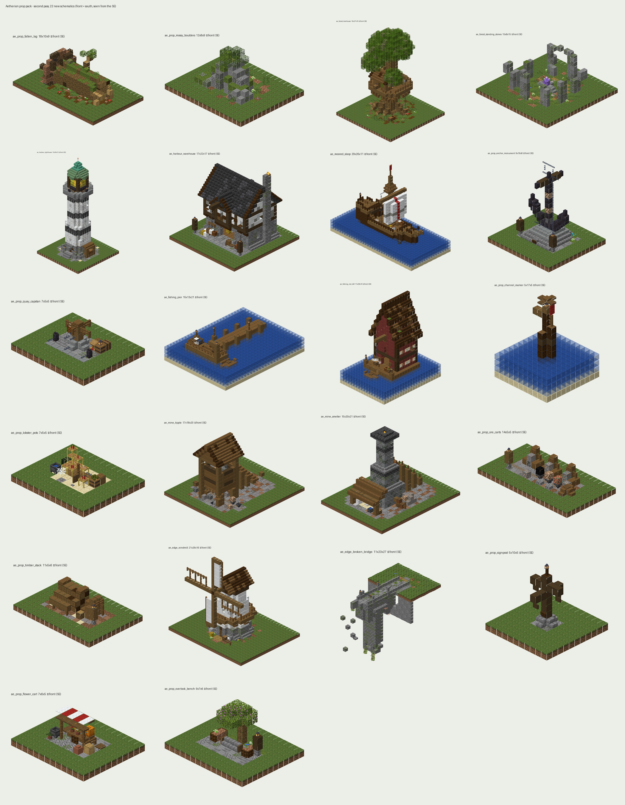

# More Props ship: Prop Wand second pass (22 new schematics)

This pass adds **22 new placeable schematics** to the Prop Wand: 11 deco accents, 2 mid pieces and 9 landmarks, covering harbour, fishing, mining, foraging and the isle edges. It is purely additive. The existing 18 schems, `PropWand` and `PropWandListener` are not touched, and the apply script hash-checks that they stay that way.

**Nothing was deployed, and the Hub was NOT compiled here** (see *Verification*). No checkout was modified. Everything is in this folder until you run the apply script.



## What's in the folder

| Path | What |
|---|---|
| `apply-more-props.ps1` | Guarded apply with `-DryRun`, `-AlsoMainCheckout`, `-Worktree`, `-Force` and `-Compile`. It only ever writes the 23 allowlisted paths below |
| `MANIFEST.tsv` | 23 `write` rows (PropCatalog + 22 schems) with base and new SHA-256, raw and CRLF→LF, plus 20 `keep` rows (the 18 old schems and the two wand classes: verified, never written) |
| `files/PropCatalog.java` | Patched catalog (CRLF like the repo): 22 entries appended after `ae_mine_headframe`, javadoc count 18 → 40 |
| `files/props/*.schem` | The 22 new Sponge v3 schematics (DataVersion 3955, same writer as the first 18) |
| `patches/PropCatalog.diff` | The same catalog change as a unified diff (LF), for review or `git apply` |
| `previews/` | Front + back render of every new piece, plus `_overview_more.png` |
| `generator/` | The prop toolkit with the second-pass builders added (`pieces/more_*.py`, `pieces/_kit.py`) |

The only paths it writes, under `<checkout>\AetherionHub\src\main\`:
- `java\de\aetherion\hub\prop\PropCatalog.java`
- `resources\props\<22 new ids>.schem`

## Apply

```powershell
cd C:\Users\Robbi\IdeaProjects\_more_props_ship
powershell -ExecutionPolicy Bypass -File .\apply-more-props.ps1 -DryRun     # expect: 23 would be written, 0 conflicts, 0 notes
powershell -ExecutionPolicy Bypass -File .\apply-more-props.ps1
# optional, same files into the main checkout too (IdeaProjects\AetherionHub has the identical 18-prop catalog):
powershell -ExecutionPolicy Bypass -File .\apply-more-props.ps1 -AlsoMainCheckout -DryRun
```

- **Default target:** the live-lineage worktree, `.claude\worktrees\mining-eldervale-progression-65660c`. It is the same default as the Main Island ship, and the Main Island ship already landed the Prop Wand there. `-Worktree <path>` points the script at another checkout.
- **Guard:** `PropCatalog.java` is replaced only if it is exactly the 18-prop version (raw or CRLF→LF SHA-256), and it keeps its own line endings. A new `.schem` is written only if nothing exists at that path. It is **all-or-nothing per checkout**: if any conflict turns up, nothing is written to that checkout. Re-running is safe, because already-landed files are skipped. `-Force` overwrites and keeps a `.bak-moreprops` copy.
- **Order vs the Main Island ship:** both ships carry byte-identical base files, so either order works. If the Main Island ship is run *again* on a checkout where this ship already landed, it reports the catalog as a CONFLICT and leaves it alone. It does not revert it.

Then build and bring the new props online:

```powershell
# from the checkout root (or pass -Compile to the apply script, which runs exactly this after writing)
mvn -q -DskipTests -pl AetherionHub -am compile      # then package as usual
```

After the restart, run `/propwand extract` (or just `/propwand`). `ensureExtracted` only writes files that don't exist yet, so the 22 new schems land in `plugins/AetherionHub/props/` and the FAWE schematics folder, and nothing existing is overwritten.

## Placing them: read this once

The wand pastes the schematic origin **exactly on the block you look at**: `lookAnchor` → `FaweIslandPaste.paste(hitX, hitY, hitZ, ignoreAir=true, rotation)`. In auto mode the **front (authored south) points the way you are looking**. So stand behind where the piece goes and look at the spot. Sneak + left-click sets a fixed rotation (0/90/180/270) if you want the front to face you instead.

The new pieces are anchored for that behaviour:

| Kind | Look at… | Pieces |
|---|---|---|
| Ground pieces | the ground block at the piece's centre. It becomes the piece's ground layer, so paths and soil sit flush and plants stand on top | all deco, windmill, lighthouse, warehouse, tipple, smelter, treehouse, standing stones |
| Quay / shore pieces | the **top block of the quay or shore edge, 1 above the water**. The piece runs out over the water the way you look | `ae_fishing_pier`, `ae_fishing_net_loft`, `ae_moored_sloop` (lies alongside the quay, 2 bollards on the edge) |
| Quay-edge deco | the quay block **1 in from the edge**. The chain leads run to the edge ahead | `ae_prop_quay_capstan` |
| Cliff pieces | the **last land block before the drop**. The span goes out over the void | `ae_edge_broken_bridge` |
| Sea-floor pieces | the **sea floor** (the ray passes through water). Built for 2–8 deep | `ae_prop_channel_marker` |

Water pieces: everything under the waterline that can hold water is waterlogged, so you get no air pockets round posts. The surface layer is left dry on purpose, so boats and decks don't fill up.

Observation, not changed: the first 18 were authored for `//paste` while standing (anchor = your feet). Through the wand they therefore land **one block lower** than intended. The new 22 don't have that offset.

### Known limit: the menu shows 27

`PropWandListener.openMenu` builds a fixed 27-slot inventory and stops at 27. With 40 props:
- Slots 19–27 (the menu) hold the first 9 new entries. I put the **spam deco** there on purpose: fallen log, boulder, lobster pots, ore carts, signpost, flower cart, overlook bench, timber stack, quay capstan.
- The other 13 (channel marker, anchor monument, pier, standing stones and the landmarks) are still fully placeable by **left-click cycling** on the wand (it cycles through all 40), or with `//schem load <id>` + `//paste -a`.
- Showing all 40 in the menu is a one-constant change: `27` → `54` in `openMenu`, both places. It is **not** done here, because this ship is catalog and schems only. Say the word if you want it.

## The 22 new pieces

`#` is the position in the catalog and wand cycle. 1–18 are the existing pieces. Sizes are W×H×L, including anything that goes below the anchor.

| # | id | Name | Zone | Type | Size | Flex | Tip (as in the catalog) |
|---|---|---|---|---|---|---|---|
| 19 | `ae_prop_fallen_log` | Fallen Giant | foraging | deco | 18×10×9 | 5-wide uprooted oak you can walk through, root plate on end with hanging roots over a mud crater | Lies across your view; walk-through hollow. |
| 20 | `ae_prop_mossy_boulders` | Split Boulder | anywhere | deco | 12×8×9 | head-high split erratic with a birch forcing up through the crack, lichen on the shady side | Grips a block into the ground. |
| 21 | `ae_prop_lobster_pots` | Lobster Pots | fishing | deco | 7×5×5 | scaffolding creel pyramid with red cork floats, line coil, oars, salt bucket | Beach or quay; tall side at the back. |
| 22 | `ae_prop_ore_carts` | Ore Carts | mining | deco | 14×5×5 | three loaded tubs (coal/iron/copper) against a buffer stop, sorting bins with plaques | Rails run across your view to the buffer. |
| 23 | `ae_prop_signpost` | Signpost | anywhere | deco | 5×10×5 | four-arm waymarker, two-sided hanging signs: Anker Harbour / Eldervale Mines / Elder Woods / Fishing Quays | Rotate so the arms match the roads. |
| 24 | `ae_prop_flower_cart` | Flower Cart | anywhere | deco | 7×6×5 | handcart of potted blooms under a red-white awning, stool, watering can | Awning side points the way you look. |
| 25 | `ae_prop_overlook_bench` | Overlook Bench | edge | deco | 9×7×6 | stone seat between planters under a flowering azalea, lamp post | Seat looks the way you look. |
| 26 | `ae_prop_timber_stack` | Timber Stack | mining | deco | 11×5×6 | cribbed pit props end-on, upright prop rack, sawhorse, chopping block | Log ends point the way you look. |
| 27 | `ae_prop_quay_capstan` | Quay Capstan | harbour | deco | 7×5×5 | spoked capstan, iron bollards with chain leads, tally lectern | Aim 1 block in from the quay edge. |
| 28 | `ae_prop_channel_marker` | Channel Marker | fishing | deco | 5×17×5 | lashed tarred piles on a rubble cairn, barnacles, lamp, bell, red pennant | Aim at the sea floor, 2–8 deep. |
| 29 | `ae_prop_anchor_monument` | Anchor Monument | harbour | deco | 9×16×8 | 16-tall rust-streaked iron anchor on a stepped plinth, plaque 'ANKER HARBOUR' | Plaque points the way you look. |
| 30 | `ae_fishing_pier` | Fishing Pier | fishing | mid | 15×13×21 | 16-long pier to a railed T-head: fog bell, bench, bait barrel, rod rack, ladder, tied rowboat | Aim at the quay edge; runs out ahead. |
| 31 | `ae_forest_standing_stones` | Standing Stones | foraging | mid | 15×8×15 | ring of 8 leaning menhirs + trilithon, glow-lichen runes, amethyst altar with candles | Aim at the glade centre; 15 across. |
| 32 | `ae_harbour_lighthouse` | Lighthouse | harbour | landmark | 13×39×13 | 39-tall banded tower, iron-railed gallery, warm glass lamp room, verdigris copper cap | Headland ground; door points ahead. |
| 33 | `ae_harbour_warehouse` | Harbour Warehouse | harbour | landmark | 17×22×17 | 'Anker Stores': stone base, jettied timber floor, hoist beam with a hanging pallet, chimney | Cargo arch points the way you look. |
| 34 | `ae_moored_sloop` | Moored Sloop | harbour | landmark | 29×26×11 | 29-long sloop alongside the quay: set sail, sterncastle cabin, crow's nest, gangplank, bollards | Aim at the quay edge, 1 above water. |
| 35 | `ae_fishing_net_loft` | Net Loft | fishing | landmark | 11×28×16 | tall red net loft on stilts, steep sawtooth roof, hoist and net bundle, landing + rowboat | Aim at the shore edge, 1 above water. |
| 36 | `ae_mine_tipple` | Ore Tipple | mining | landmark | 17×18×20 | ore bin on legs over the rails, funnel chute, incline trestle to the dump deck, headhouse roof | Rails run across your view under the bin. |
| 37 | `ae_mine_smelter` | Smelter | mining | landmark | 15×20×21 | stepped stone stack with a smoking chimney, glowing hearth, bellows, charging ramp, casting shed | Hearth points the way you look. |
| 38 | `ae_forest_treehouse` | Treehouse | foraging | landmark | 16×27×16 | giant oak (27 tall) with a wraparound deck, ranger hut, ladder + hatch, pulley basket | Hut door points the way you look. |
| 39 | `ae_edge_windmill` | Windmill | edge | landmark | 21×26×16 | tower mill, whitewashed taper, reefing stage, boat cap, 10-long sails (2 clothed, 2 lattice) | Sails point the way you look. |
| 40 | `ae_edge_broken_bridge` | Broken Bridge | edge | landmark | 11×23×27 | stone span leaving the lip, hanging pier into the void, snapped end, rubble held mid-air | Aim at the last block before the drop. |

Material notes, all vanilla 1.21.1:
- Waxed copper on the lighthouse cap, so it never oxidises further.
- Lit campfires smoke on the smelter and warehouse chimneys and in the smelter hearth. Campfires were chosen over furnaces because furnaces go unlit without fuel.
- Lit candles on the stone altar. Signs are waxed, like the first 18.
- Cobwebs stand in for nets (pier, net loft, lobster pots). Scaffolding stands in for creels and hoppers for ore tubs.
- The rubble under the broken bridge floats on purpose: soft magic.

## Verification

Done here:
- **Schematics:** `generator/validate_more.py` returns **22/22 OK**. It checks Sponge v3 tag layout, DataVersion 3955, every palette state canonical against the 1.21.1 registry, and block entities on matching blocks. It also confirms the anchor is inside the region, there are 0 support warnings (no floating plants, lanterns, candles, ladders or carpets), each file equals a fresh build block-for-block, and nothing is left dry under a waterline.
- **Same writer as the first 18:** the toolkit rebuilt `ae_prop_lantern_post` and `ae_boathouse` identical to the shipped files, apart from the Metadata date.
- **Catalog:**
  - The base `PropCatalog.java` is byte-exact. It was taken from your local git index and packs; the index stat matched the working file.
  - The same file (CRLF, `3954c185…`) is also what the Main Island ship put into the live worktree.
  - The patched catalog compiles with `javac` against stub `Material` and `Plugin` types and runs: 40 props, no duplicate ids, `get` and `indexOf` work.
  - All 22 icon names exist as 1.21.1 items.
- **Apply script:** run under PowerShell 7 on copies of the catalog tree:
  - CRLF base: 23 written, rerun 23 up to date
  - LF base: 23 written, LF kept
  - edited base: CONFLICT, nothing written, exit 1
  - The 18 old schems and the wand classes reported unchanged every time.

**Not done:**
- **The real `mvn compile` of AetherionHub.** My sandbox can't reach the Paper, EngineHub or Maven Central repositories, and you're doing the compile yourself. Use `-Compile` or the mvn line above.
- Windows PowerShell 5.1 itself wasn't available to run. The script uses only 5.1-compatible syntax and is ASCII-only.
- No in-game paste. The previews are renders of the actual schematic blocks.

## Regenerating / tweaking a piece

```powershell
cd generator
pip install nbtlib pillow numpy
python build_more.py                       # all 22  -> ..\schematics + ..\previews (set AE_OUT to redirect)
python build_more.py ae_edge_windmill      # one piece
python validate_more.py ..\schematics      # strict re-check
python overview_more.py                    # contact sheet
python peek.py ae_moored_sloop 20 0,2      # quick big render (needs vanilla textures, see generator\README.md)
```

Builders live in `pieces/more_*.py`, and the shared helpers are in `pieces/_kit.py`: anchors, waterlogging, discs and rings, boulders, the big tree, and `tidy` for support. Builds are deterministic (fixed seeds). After a rebuild, copy the `.schem` into `files/props/` and refresh its hashes in `MANIFEST.tsv`. If you don't, the apply script refuses the file as `SHIP FILE CHANGED`.
